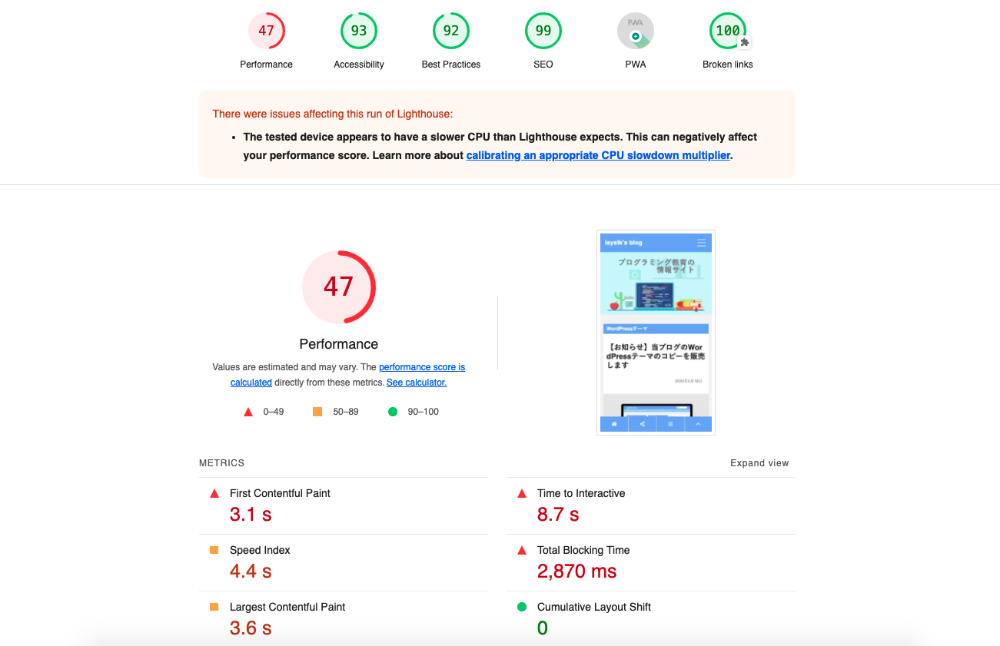

🌙 lighthouse-sample
====


## 📗 プロジェクトの概要

Lighthouse はオープンソースの自動化されたツールでウェブアプリの品質向上に役立ちます。このツールは Chrome 拡張機能として実行するか、コマンドラインから実行できます。 Lighthouse に監査したい URL を指定して実行すると、ページに対する集中的なテストを実行してパフォーマンスに関するレポートを生成できます。 今後は弱点を検出するテストを利用して、アプリの品質改善の指針を得られるようになります。
CLI を利用することで、リンク切れチェックなどLighthouseをよりパワフルで便利にすることができます。

## 🌐 Demo



## 🔧 環境構築

```
# Windowsの場合
$ curl -L git.io/nodebrew | perl - setup
# Macの場合
$ brew install nodebrew

# nodebrew をシェルのパスに追加する
$ echo 'export PATH=$HOME/.nodebrew/current/bin:$PATH' >> ~/.bashrc

# Node.js をインストール 
$ mkdir -p ~/.nodebrew/src
$ nodebrew ls-remote
$ nodebrew install v12.21.0
$ nodebrew use v12.21.0
$ npm install -g yarn

```

## 📦 ディレクトリ構造

```
.
├── audits 
│   └── broken-link.js
│
├── plugin.js
└── package.json
```

## 💬 使い方

```
# モジュールのインストール
$ yarn

# npmのglobalパスへシンボリックリンクを作成します
$ npm link
# currentパスへシンボリックリンクを作成します
$ npm link lighthouse-plugin-example

# lighthouseコマンドで計測してみる
$ npx lighthouse https://blog.isystk.com --plugins=lighthouse-plugin-example --view 

# Express経由で計測結果を取得する
$ yarn start
$ curl "http://localhost:3000/lighthouse?url=https://blog.isystk.com" > ./result.output 

```

## 🎨 参考

| プロジェクト| 概要|
| :---------------------------------------| :-------------------------------|
| [Lighthouseをよりパワフルで便利にする](https://qiita.com/murajun1978/items/f89df7a30890fa23fa87)| Lighthouseをよりパワフルで便利にする|


## 🎫 Licence

[MIT](https://github.com/isystk/lighthouse-sample/blob/master/LICENSE)

## 👀 Author

[isystk](https://github.com/isystk)


